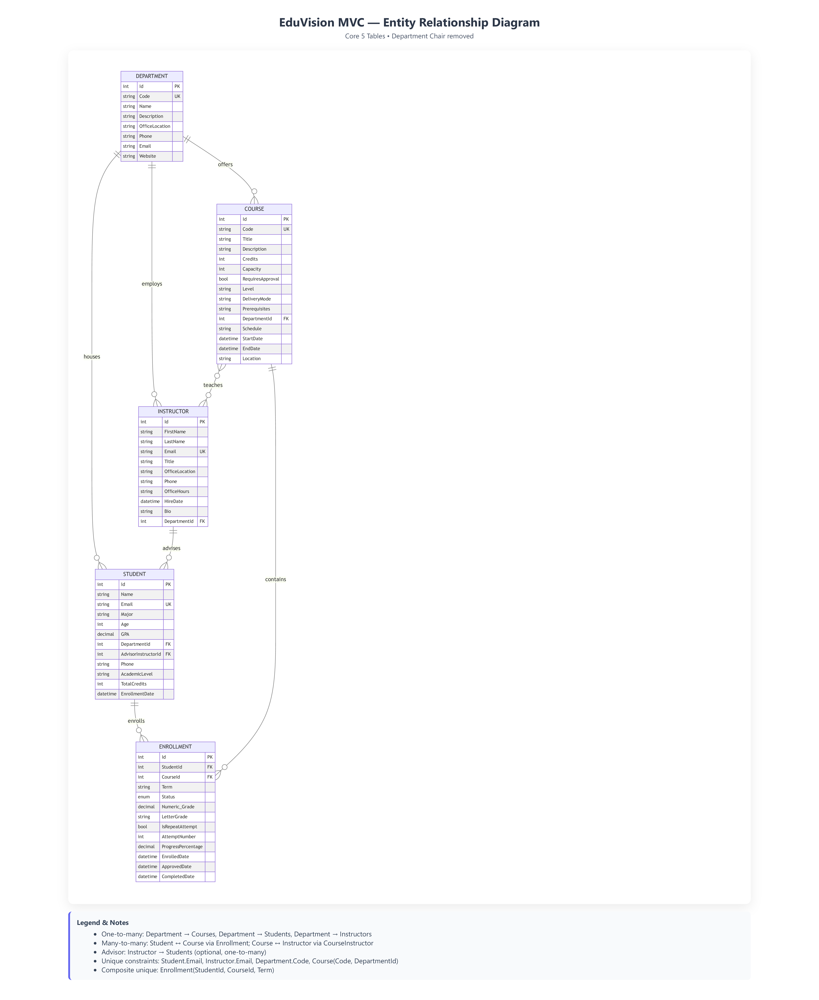

# 🎓 EduVision MVC - Academic Management Platform# 🎓 EduVision MVC


**EduVisionMVC** is a comprehensive academic management web application built with **ASP.NET Core 9 MVC** and **Entity Framework Core**, designed to streamline educational operations across multiple role-based dashboards with real-time data synchronization and interactive visualizations.**EduVisionMVC** is a dynamic academic management web application built with **ASP.NET Core MVC** and **Entity Framework Core**, designed to demonstrate full-stack capabilities — from CRUD operations to interactive visualizations and intelligent chat integration.


[](https://eduvisionmvc.azurewebsites.net/)---

[](https://github.com/rajkarthikmanam/EduvisionMVC-portfolio)

## 🚀 Features

---

- 🔐 **Role-based user access** *(Admin, Instructor, Student)*  

## 🌟 Key Features- 📊 **Interactive dashboards** using Chart.js  

- 🧠 **AI-powered chatbot** integration via **Botpress**  

### 🔐 Multi-Role Authentication System- 🗂️ **Complete CRUD** for Students, Courses, Departments, and Enrollments  

- **Three distinct dashboards**: Admin, Instructor, and Student portals- 🌐 **RESTful API layer** for data access  

- **ASP.NET Core Identity** integration with secure role-based access control- 🏗️ **Modular architecture** using EF Core migrations and seed data  

- **Custom registration flows** for Students and Instructors with automatic domain entity linking- 💬 **Modern UI** (Bootstrap 5 + custom theme)  

- **Session management** with persistent login and logout functionality

---

### 📊 Dynamic Interactive Visualizations

- **Real-time Chart.js integration** displaying:## 🧩 Tech Stack

  - Student enrollment trends by department

  - Course popularity analytics| Layer | Technology |

  - GPA distribution across academic levels|--------|-------------|

  - Instructor workload metrics| **Frontend** | Razor Views, HTML5, CSS3, Bootstrap 5 |

  - Department capacity utilization| **Backend** | ASP.NET Core MVC (.NET 9), C#, Entity Framework Core |

- **Dashboard interconnectivity**: Changes in one dashboard instantly reflect across all three portals| **Database** | SQLite (Local), ready for SQL Server/Azure |

  - Example: When an instructor approves a student enrollment, the student dashboard updates enrollment status immediately| **Data Viz** | Chart.js |

  - Admin modifications to course capacity trigger real-time chart updates across instructor and student views| **AI Chat** | Botpress Cloud Webchat v3 |

  - Department changes cascade through all related courses, instructors, and student assignments| **Version Control** | Git + GitHub |

| **Deployment** | Azure App Service / IIS |

### 🗂️ Complete CRUD Operations

- **Students**: Manage academic records, enrollment status, GPA tracking, advisor assignments---

- **Courses**: Course creation, capacity management, prerequisite tracking, schedule coordination

- **Departments**: Organizational structure, department chair assignments, faculty management## 👥 Contributors

- **Enrollments**: Workflow management (Pending → Approved → Completed), grade recording, progress tracking

- **Instructors**: Faculty profiles, course assignments, office hours, student advising| Name | Role | GitHub |

|------|------|--------|

### 🌐 RESTful API Layer| **Raj Karthik Manam** | Backend Development, API Integration, Deployment, Botpress Integration, GitOps | [@rajkarthikmanam](https://github.com/rajkarthikmanam) |

- **Dedicated API endpoints** (`/api/students`, `/api/courses`, `/api/departments`, `/api/enrollments`)| **Ananya Gullapally** | Frontend Design, UI/UX Enhancements, Visualization Layouts, README & Docs | [@ananyausf](https://github.com/ananyausf) |

- **JSON data access** for external integrations and frontend AJAX calls

- **Chart data endpoints** (`/api/charts/*`) serving aggregated analytics for visualization components---


### 🧠 AI-Powered Chatbot Integration## ⚙️ Deployment Notes

- **Botpress v3 Webchat** embedded across all dashboards

- Context-aware assistance for navigation, course information, and enrollment guidance1. **Clone the repo**

- Persistent chat history across page transitions   ```bash

   git clone https://github.com/rajkarthikmanam/EduvisionMVC-portfolio.git

### 🏗️ Robust Architecture   cd EduvisionMVC-portfolio

- **Environment-based database providers**: SQLite for Development, SQL Server for Production
- **EF Core migrations** with automatic schema deployment on Azure
- **Seed data management** for initial system population with sample academic data
- **Diagnostic endpoints** for migration monitoring and environment validation

---

## 🧩 Tech Stack

| Layer | Technology |
|--------|-------------|
| **Frontend** | Razor Views, HTML5, CSS3, Bootstrap 5, Chart.js |
| **Backend** | ASP.NET Core 9 MVC, C# 13, Entity Framework Core 9 |
| **Database** | SQLite (Development), SQL Server (Production/Azure) |
| **Authentication** | ASP.NET Core Identity with role-based authorization |
| **Data Visualization** | Chart.js 4.x with dynamic data binding |
| **AI Integration** | Botpress Cloud Webchat v3 |
| **Version Control** | Git + GitHub with Actions-based CI/CD |
| **Deployment** | Azure App Service with automated GitHub Actions pipeline |

---

## 📐 Database Architecture (ERD)

The system implements a normalized relational model with **5 core entities** and **15+ supporting tables** managing comprehensive academic operations:

### Core Entities:
- **Student** (12 properties): Academic tracking, GPA, enrollment history, advisor linkage
- **Course** (15 properties): Capacity management, prerequisites, approval workflows, scheduling
- **Enrollment** (14 properties): Junction table with status workflow (Pending → Approved → Completed)
- **Department** (9 properties): Organizational hierarchy, chair assignment, resource allocation
- **Instructor** (11 properties): Faculty management, course assignments, student advising

### Key Relationships:
- **Department → Courses** (one-to-many): Organizational course ownership
- **Department → Students** (one-to-many with SetNull): Optional academic home assignment
- **Department → Instructors** (one-to-many with Restrict): Faculty department affiliation
- **Student ↔ Course** (many-to-many via Enrollment): Enrollment tracking with grades and status
- **Course ↔ Instructor** (many-to-many via CourseInstructor): Teaching assignments
- **Instructor → Students** (one-to-many as Advisor with SetNull): Academic advising relationships
- **Department.Chair → Instructor** (one-to-one with Restrict): Department leadership

### Identity & Extended Tables:
- **ApplicationUser**: Extended ASP.NET Identity user with domain links (StudentId, InstructorId)
- **AspNetRoles/AspNetUserRoles**: Role-based access control (Admin, Instructor, Student)
- **UserProfile**: Extended user information (bio, skills, interests, social links)
- **Notifications**: User-specific alert system
- **EnrollmentHistory**: Audit trail for enrollment changes
- **Assignments/Submissions**: Course assignment management
- **CourseMaterials**: Document and resource storage
- **Discussions/DiscussionPosts**: Forum-style course communication
- **CourseAnnouncements**: Instructor-to-student broadcast messages

### Database Constraints:
- **Unique composite indexes**: Student email, Instructor email, Course code per department
- **Cascade delete protection**: Restrict behaviors on critical relationships to prevent data loss
- **Precision definitions**: Decimal(3,2) for GPAs and grades, Decimal(18,2) for audit history
- **Foreign key integrity**: Enforced at database level with appropriate delete behaviors



*Complete ERD showing all 15+ tables, relationships, and cascade behaviors. Available in the About page with interactive exploration.*

---

## 🎯 Dashboard Interconnectivity & Testing Guide

### How Dashboard Interconnectivity Works

EduVision implements **real-time data synchronization** across all three dashboards through shared EF Core models and immediate database persistence. This creates a seamless experience where actions in one dashboard cascade appropriately to others.

#### Example Interconnectivity Flows:

**1. Enrollment Workflow (Student → Instructor → Student)**
```
Student Dashboard: Submit enrollment request for "Advanced Databases"
   ↓ (Status: Pending, recorded in Enrollments table)
Instructor Dashboard: View pending enrollments, approve request
   ↓ (Status: Pending → Approved, timestamp recorded)
Student Dashboard: Enrollment list updates, course appears in "My Courses"
   ↓ (Real-time reflection without page refresh dependency)
```

**2. Grade Entry (Instructor → Student → Charts)**
```
Instructor Dashboard: Enter final grade (3.75) for student enrollment
   ↓ (NumericGrade updated, CompletedDate timestamp set)
Student Dashboard: GPA recalculated automatically, transcript updated
   ↓ (Computed property reevaluates on next page load)
Charts Dashboard: GPA distribution chart updates with new data point
   ↓ (Aggregate queries reflect latest grades)
```

**3. Department Changes (Admin → Instructor → Student → Charts)**
```
Admin Dashboard: Update Department capacity or chair assignment
   ↓ (Department table modified, foreign keys cascade)
Instructor Dashboard: Department stats refresh, new chair visible
   ↓ (Navigation properties reload related data)
Student Dashboard: Department affiliation reflects changes
   ↓ (Students see updated department information)
Charts Dashboard: Department-based analytics recalculate
   ↓ (Chart.js re-renders with updated aggregates)
```

### Comprehensive Testing Guide

#### **1. Authentication & Authorization Testing**

**Test Student Registration:**
1. Navigate to `/Account/Register`
2. Fill in: Email, Password, FirstName, LastName, Major, EnrollmentDate
3. Submit form
4. **Verify**: Redirected to Student Dashboard
5. **Check**: Student record created in Students table
6. **Check**: ApplicationUser created with StudentId foreign key populated
7. **Check**: User assigned "Student" role in AspNetUserRoles

**Test Instructor Registration:**
1. Navigate to `/Account/RegisterInstructor`
2. Fill in: Email, Password, FirstName, LastName, Department, Title
3. Submit form
4. **Verify**: Redirected to Instructor Dashboard
5. **Check**: Instructor record created in Instructors table
6. **Check**: ApplicationUser created with InstructorId foreign key populated
7. **Check**: User assigned "Instructor" role

**Test Role-Based Access:**
1. Login as Student
2. Try accessing `/Instructors` or `/Departments/Edit/{id}`
3. **Verify**: Access denied (403 Forbidden or redirect)
4. Logout and login as Instructor
5. Access `/Courses` and `/Students`
6. **Verify**: Full CRUD access granted

#### **2. Dashboard Interconnectivity Testing**

**Test Enrollment Approval Flow:**
1. **Student Dashboard**: 
   - Login as student
   - Navigate to "Enroll in Course"
   - Select course (e.g., "Database Systems")
   - Submit enrollment request
   - **Verify**: Enrollment appears in "My Enrollments" with Status = Pending
   
2. **Instructor Dashboard**:
   - Logout and login as instructor teaching "Database Systems"
   - Navigate to "Course Enrollments" or "Manage Enrollments"
   - **Verify**: New enrollment request visible with Pending status
   - Click "Approve" button
   - **Verify**: Status changes to Approved, ApprovedDate timestamp set
   
3. **Student Dashboard** (return):
   - Logout and login as original student
   - Navigate to "My Enrollments"
   - **Verify**: Status now shows Approved
   - **Verify**: Course appears in active enrollments list

**Test Grade Entry Propagation:**
1. **Instructor Dashboard**:
   - Login as instructor
   - Navigate to "Grade Management" or specific course enrollment list
   - Select student enrollment
   - Enter NumericGrade (e.g., 3.50)
   - Change Status to Completed
   - Submit changes
   
2. **Student Dashboard**:
   - Logout and login as that student
   - Navigate to "My Transcript" or "Academic Progress"
   - **Verify**: Grade appears for completed course
   - **Verify**: GPA recalculated and updated
   - Check "Completed Credits" count
   - **Verify**: Credits from graded course added to total

3. **Charts Dashboard**:
   - Navigate to `/charts` or home dashboard
   - View "GPA Distribution" chart
   - **Verify**: New data point reflected in visualization
   - Check "Enrollment Status" breakdown
   - **Verify**: Completed enrollment count incremented

**Test Department Update Cascade:**
1. **Admin Dashboard**:
   - Login as admin (or use DevSeed to create admin user)
   - Navigate to `/Departments`
   - Edit department (e.g., "Computer Science")
   - Change: OfficeLocation, Phone, or Chair assignment
   - Save changes
   
2. **Instructor Dashboard**:
   - Login as instructor in that department
   - View profile or department affiliation
   - **Verify**: Updated department information visible
   - If chair changed, verify new chair displayed
   
3. **Student Dashboard**:
   - Login as student in that department
   - Navigate to "My Department" or academic info section
   - **Verify**: Department details reflect updates
   
4. **Verify Database**:
   - Use `/api/departments/{id}` endpoint
   - Confirm JSON response shows updated values
   - Check foreign key relationships remain intact

#### **3. Dynamic Chart Testing**

**Test Chart Data Accuracy:**
1. Navigate to `/charts` or home dashboard
2. Identify "Enrollments by Department" chart
3. **Count manually**:
   - Go to `/api/enrollments`
   - Group by CourseId → DepartmentId
   - Tally enrollments per department
4. **Compare**: Chart bar heights should match manual counts
5. **Verify legend**: Department names correctly labeled

**Test Real-Time Chart Updates:**
1. Open `/charts` in one browser tab
2. Open `/Enrollments/Create` in another tab
3. Create new enrollment
4. Return to charts tab and refresh
5. **Verify**: Enrollment count for that department increased by 1
6. **Verify**: Chart bar height adjusted proportionally

**Test Multiple Chart Types:**
- **Bar Chart** (Enrollments by Department): Verify category labels and bar heights
- **Line Chart** (GPA Trends): Check data points align with timeline
- **Pie Chart** (Student Distribution): Confirm percentages add to 100%
- **Doughnut Chart** (Course Capacity): Verify available vs. enrolled ratios

#### **4. CRUD Operation Testing**

**Students CRUD:**
- **Create**: Add new student, verify all fields saved
- **Read**: View student list, details page, search functionality
- **Update**: Edit student info (GPA, Major, Advisor), confirm persistence
- **Delete**: Remove student record, verify cascade behavior on enrollments
- **Validation**: Test required fields, email format, GPA range (0-4.0)

**Courses CRUD:**
- **Create**: Add new course with prerequisites, capacity, schedule
- **Read**: List courses, filter by department, view course details
- **Update**: Modify course code, capacity, delivery mode
- **Delete**: Attempt delete with active enrollments (should fail or warn)
- **Business Rules**: Test capacity enforcement, unique code per department

**Enrollments CRUD:**
- **Create**: Enroll student in course, verify term uniqueness constraint
- **Read**: View enrollments filtered by student, course, or status
- **Update**: Change status (Pending → Approved → Completed), enter grades
- **Delete**: Remove enrollment, check EnrollmentHistory audit trail
- **Workflow**: Test status transitions and validation rules

**Departments CRUD:**
- **Create**: Add new department with code, name, chair
- **Read**: List all departments, view department details with course count
- **Update**: Change department chair, update contact information
- **Delete**: Verify Restrict behavior on Instructors prevents accidental deletion
- **Relationships**: Confirm courses, students, instructors linked correctly

**Instructors CRUD:**
- **Create**: Add new instructor, assign to department
- **Read**: List instructors, view profile with assigned courses
- **Update**: Modify office hours, contact info, bio
- **Delete**: Check cascade impact on CourseInstructor join table
- **Advising**: Assign/reassign students to advisor, verify SetNull behavior

#### **5. API Endpoint Testing**

**Test JSON Responses:**
```bash
# Get all students
curl https://eduvisionmvc.azurewebsites.net/api/students

# Get specific course
curl https://eduvisionmvc.azurewebsites.net/api/courses/5

# Get department enrollments
curl https://eduvisionmvc.azurewebsites.net/api/enrollments?departmentId=2

# Get chart data
curl https://eduvisionmvc.azurewebsites.net/api/charts/enrollments-by-department
```

**Verify Response Structure:**
- Status code: 200 OK for successful requests
- Content-Type: application/json
- Data format: Array of objects with expected properties
- Relationships: Nested objects or IDs for foreign keys

#### **6. Edge Case & Validation Testing**

**Test Duplicate Prevention:**
- Try enrolling same student in same course for same term
- **Verify**: Unique constraint error caught and handled gracefully

**Test Capacity Limits:**
- Enroll students up to course capacity
- Attempt enrollment beyond capacity
- **Verify**: Validation message or enrollment rejection

**Test Cascade Delete Behaviors:**
- Delete department with instructors (should fail with Restrict)
- Delete student with active enrollments (should cascade delete enrollments)
- Delete instructor who is department chair (should fail with Restrict)
- Delete course with enrollments (verify cascade or prevention)

**Test Grade Validation:**
- Enter NumericGrade > 4.0 or < 0.0
- **Verify**: Validation error displayed
- Enter grade without setting Status to Completed
- **Verify**: Business rule warning or automatic status update

**Test Authentication Edge Cases:**
- Access protected routes without login → Redirect to login page
- Access instructor routes as student → 403 Forbidden
- Session timeout behavior → Re-login required
- Password reset flow (if implemented) → Verify email/token workflow

---

## 🚀 Setup & Deployment

### Local Development Setup

1. **Clone the repository**
   ```bash
   git clone https://github.com/rajkarthikmanam/EduvisionMVC-portfolio.git
   cd EduvisionMVC-portfolio
   ```

2. **Restore dependencies**
   ```bash
   dotnet restore
   ```

3. **Apply migrations** (SQLite database will be created automatically)
   ```bash
   dotnet ef database update
   ```

4. **Seed sample data** (optional, visit endpoint or uncomment in Program.cs)
   ```bash
   # Run the app and navigate to:
   https://localhost:5001/DevSeed
   ```

5. **Run the application**
   ```bash
   dotnet run
   ```

6. **Access the app**
   - Open browser: `https://localhost:5001`
   - Default SQLite database: `App_Data/eduvision.db`

### Production Deployment (Azure)

**Automated GitHub Actions Pipeline:**

The application uses a publish profile-based deployment workflow:

1. **Workflow Trigger**: Push to `main` branch
2. **Build Step**: 
   - `dotnet publish -c Release`
   - Migrations included in publish output
3. **Environment Configuration**:
   - `ASPNETCORE_ENVIRONMENT=Production` injected via web.config transformation
   - Connection string stored in Azure App Service Configuration
4. **Deployment**:
   - Publish artifacts zipped
   - Deployed to Azure App Service via publish profile
5. **Post-Deployment**:
   - Automatic migration application on app startup
   - Seed data initialization if database empty

**Manual Deployment:**

```bash
# Build for production
dotnet publish -c Release -o ./publish

# Deploy via Azure CLI (alternative)
az webapp deploy --resource-group <resource-group> \
                 --name eduvisionmvc \
                 --src-path ./publish.zip
```

**Environment Variables (Azure App Service Configuration):**
- `ASPNETCORE_ENVIRONMENT`: Production
- `ConnectionStrings__DefaultConnection`: SQL Server connection string (Azure SQL Database)

---

## 🧪 Challenges and Key Learnings

### Technical Challenges Overcome

#### 1. **CI/CD Configuration Complexity**
**Challenge**: Setting up a secure and automated deployment pipeline with GitHub Actions and Azure App Service required extensive debugging of publish profiles, environment variable injection, and build artifact management.

**Solution**: 
- Implemented publish profile-based deployment approach for stable Azure integration
- Created web.config transformation to inject `ASPNETCORE_ENVIRONMENT` variable
- Configured zip-based deployment artifacts excluding unnecessary build files
- Added diagnostic endpoints (`/Diagnostics/Env`, `/Diagnostics/Migrations`) for runtime verification

**Learning**: Azure deployment workflows benefit from incremental testing and clear separation of build vs. runtime configuration.

#### 2. **EF Core Migration Conflicts**
**Challenge**: Multiple migration regeneration cycles caused schema drift, duplicate migration files in publish output triggering compilation errors, and `PendingModelChangesWarning` preventing migration application.

**Solution**:
- Implemented `AppDbContextFactory` for design-time SQL Server context, ensuring migrations generated with production provider
- Added `.csproj` exclusion rules to prevent `/publish/**/*.cs` compilation
- Deleted and regenerated clean migrations aligned with model snapshot
- Configured environment-based provider selection (SQLite dev, SQL Server prod)

**Learning**: Migration tooling requires consistent provider usage between generation and application; design-time factories solve cross-provider issues.

#### 3. **Multiple Cascade Path Errors (SQL Server)**
**Challenge**: SQL Server rejected initial migration with error: "may cause cycles or multiple cascade paths" on `FK_Students_Instructors_AdvisorInstructorId` due to conflicting cascade routes through Department relationships.

**Solution**:
- Changed `Instructor → Department` relationship from Cascade to Restrict
- Modified `Department.Chair → Instructor` from SetNull to Restrict
- Kept `Student.AdvisorInstructor` as SetNull (safe path)
- Updated both `AppDbContext` configuration and migration `ReferentialAction` values

**Learning**: SQL Server enforces stricter cascade rules than SQLite; complex relationship graphs require explicit `DeleteBehavior` planning to prevent ambiguous cascade paths.

#### 4. **Authentication Redirect Loops**
**Challenge**: Initial global `FallbackPolicy` requiring authentication caused infinite redirect loops on `/Account/Login` and `/Account/Register` pages.

**Solution**:
- Removed global `RequireAuthenticatedUser()` fallback policy
- Applied `[Authorize]` attributes selectively to protected controllers
- Added `[AllowAnonymous]` explicitly to authentication endpoints (Login, Register, RegisterInstructor)
- Implemented role-based authorization with `[Authorize(Roles = "Admin")]` where needed

**Learning**: Global authorization policies should be avoided in MVC apps with public-facing authentication pages; explicit attribute-based authorization provides better control.

#### 5. **Identity Table Sync (AspNetUsers Missing)**
**Challenge**: Login/register operations failed with "Invalid object name 'AspNetUsers'" despite migrations appearing in codebase, caused by migrations never executing on Azure SQL.

**Solution**:
- Created `/Diagnostics/ApplyMigrations` endpoint to manually trigger `context.Database.Migrate()`
- Added automatic migration application in `Program.cs` startup (Production environment only)
- Wrapped migration calls in try/catch to log errors without crashing app startup
- Verified migration application via `/Diagnostics/Migrations` reporting endpoint

**Learning**: Azure App Service doesn't automatically apply EF migrations; explicit migration triggering is required either at startup or via diagnostic endpoints.

#### 6. **Interlinked Dashboard Dependencies**
**Challenge**: Functional dependencies across Student/Instructor/Admin dashboards created chain effects when modifying shared models or controllers, causing layout breaks or data binding errors.

**Solution**:
- Established strict model contracts with comprehensive navigation properties
- Implemented centralized `IdentitySeeder` for consistent role and initial user creation
- Used `EnsureDomainLinksByEmailAsync` helper to synchronize ApplicationUser ↔ Student/Instructor linkage
- Coordinated incremental commits between frontend and backend changes

**Learning**: Shared data models in multi-dashboard apps require tight version control coordination and comprehensive integration testing after each schema change.

### Team Coordination Insights

- **Communication Cadence**: Daily stand-ups and deploy coordination prevented merge conflicts and ensured consistent schema expectations
- **Git Workflow**: Feature branches with PR reviews improved code quality; however, migration files required special handling to avoid conflicts
- **Incremental Testing**: Testing authentication flows and CRUD operations after each deploy iteration caught regressions early
- **Documentation**: Maintaining detailed commit messages and inline code comments accelerated debugging when issues surfaced days later

---

## 🔮 Future Improvements

### 🔐 Advanced Password Management System
**Priority: High**

While ASP.NET Identity currently securely hashes all passwords (no plain-text storage even for administrators), future enhancements will include:
- **Password reset workflows** with time-limited email tokens
- **Multi-Factor Authentication (MFA)** via SMS or authenticator apps
- **Email verification** on registration to confirm user identity
- **Password strength meters** and complexity requirements
- **Account lockout policies** after failed login attempts

### 📊 Enhanced Analytics & Reporting
- **Real-time performance dashboards** with drill-down capabilities
- **Predictive analytics** for student success metrics (at-risk identification)
- **Automated report generation** (PDF/Excel exports for transcripts, enrollment reports)
- **Custom query builder** for administrators to create ad-hoc reports

### 🔔 Notification System Expansion
- **Email notifications** for enrollment approvals, grade postings, assignment due dates
- **Push notifications** via browser APIs for real-time alerts
- **Configurable notification preferences** per user
- **Automated instructor reminders** for pending approvals or grading tasks

### 🌐 RESTful API Expansion
- **Full API documentation** with Swagger/OpenAPI specification
- **Authentication tokens** (JWT) for external API consumers
- **Webhook support** for third-party integrations
- **Rate limiting** and API key management

### 🧪 Automated Testing Pipeline
- **Unit tests** for business logic and model validation
- **Integration tests** for API endpoints and database operations
- **End-to-end tests** using Playwright or Selenium for UI workflows
- **CI/CD integration** with test execution gates before deployment

### 🎨 UI/UX Enhancements
- **Dark mode** theme toggle
- **Accessibility improvements** (WCAG 2.1 AA compliance)
- **Mobile-first responsive design** refinements
- **Drag-and-drop** course scheduling interface
- **Calendar view** for academic deadlines and events

### 📱 Mobile Application
- **Progressive Web App (PWA)** for offline access
- **Native mobile apps** (iOS/Android) using .NET MAUI
- **Mobile-optimized dashboards** with streamlined navigation

---

## 👥 Contributors

| Name | Role | GitHub | Contributions |
|------|------|--------|---------------|
| **Raj Karthik Manam** | Backend Developer<br/>System Architect<br/>DevOps Engineer | [@rajkarthikmanam](https://github.com/rajkarthikmanam) | Backend architecture, EF Core models, API development, authentication system, Azure CI/CD pipeline, database migrations, Botpress integration, Git workflow management, deployment troubleshooting, diagnostic tooling |
| **Ananya Gullapally** | Frontend Developer<br/>UI/UX Designer<br/>QA Engineer | [@ananyausf](https://github.com/ananyausf) | Frontend design, Razor views, Bootstrap layouts, Chart.js visualizations, responsive design, user testing, documentation, Botpress UI integration, cross-browser compatibility, accessibility enhancements |

### Self-Reflections

Detailed individual reflections on time spent, key learnings, challenges, and suggestions for improvement are available on the [About page](https://eduvisionmvc.azurewebsites.net/Home/About).

---

## 📄 License

This project is developed for educational purposes as part of coursework at the University of South Florida. All rights reserved.

---

## 🙏 Acknowledgments

- **University of South Florida** - Academic support and resources
- **Microsoft Documentation** - ASP.NET Core and EF Core guidance
- **Chart.js Community** - Visualization library and examples
- **Botpress Team** - AI chatbot platform and documentation
- **Stack Overflow Community** - Troubleshooting assistance
- **Azure Support** - Deployment platform and documentation

---

## 📞 Contact & Support

For questions, issues, or collaboration inquiries:

- **GitHub Issues**: [Open an issue](https://github.com/rajkarthikmanam/EduvisionMVC-portfolio/issues)
- **Email**: rajkarthikmanam@usf.edu
- **Live Demo**: [https://eduvisionmvc.azurewebsites.net/](https://eduvisionmvc.azurewebsites.net/)

---

**Built with ❤️ using ASP.NET Core MVC**
